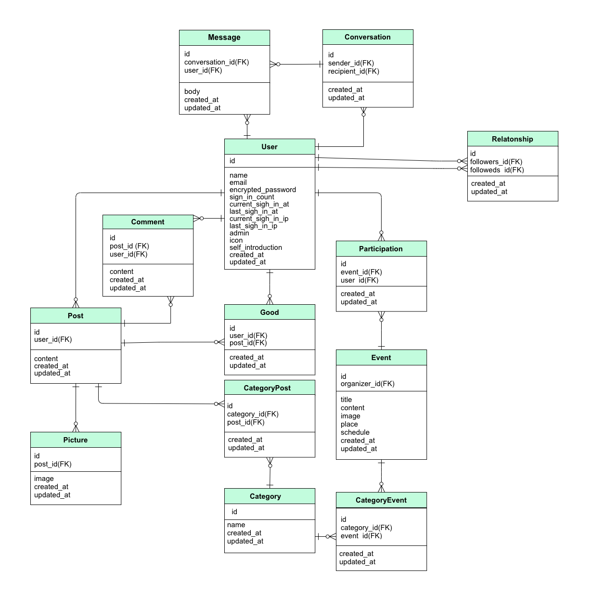
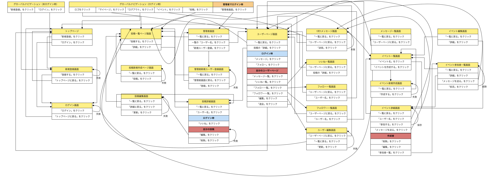

# README

## 開発言語

- Ruby 2.6.5
- Ruby on Rails 5.2.5


## 就業Termの技術

- devise
- お気に入り機能
- フォロー機能


## カリキュラム外の技術

- ransack


## 実行手順

```
$ git clone git@github.com:k-koki0701/mysdgs.git
$ cd mysdgs
$ bundle install
$ rails db:create db:migrate
$ rails s
```

## カタログ設計
https://docs.google.com/spreadsheets/d/1oySW2Nz2i70vo-r9e2txt60AsfpP_8540Yi0X9nl7EU/edit#gid=0


## テーブル定義書
https://docs.google.com/spreadsheets/d/1BFjRJ47gy3dDUI-fFFkGn-aHVryIuJbY8auF9DyFogo/edit#gid=0


## ワイヤーフレーム
https://cacoo.com/diagrams/x5PAQCQ8hnQ6L8zj/1D8B5


## ER図
https://cacoo.com/diagrams/xxNnYD88ThKsFNIR/89C22




## 画面遷移図
https://cacoo.com/diagrams/3Fh5Nz4mZ8ThBEme/D2745?reload_rt=1625633851246_0&


