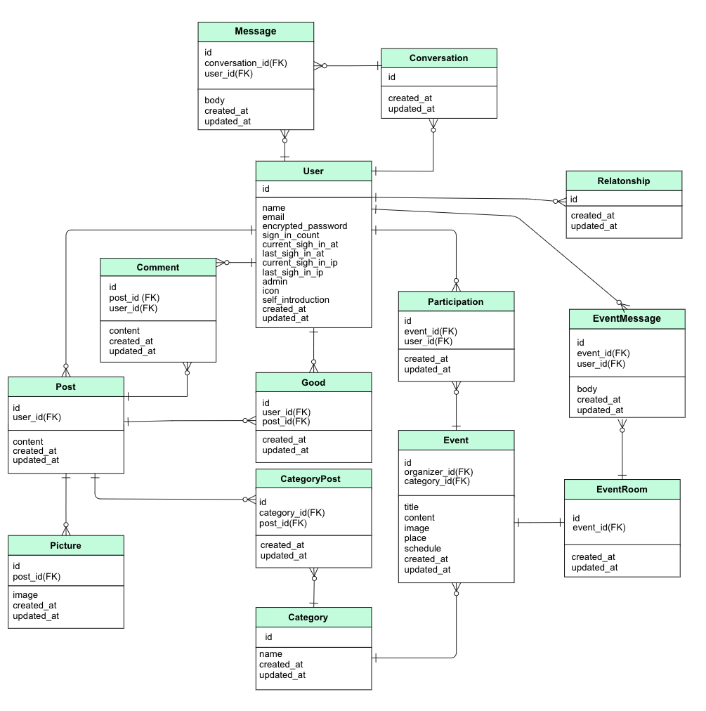

# My SDGs

## SDGsに特化したSNSアプリケーション「MySDGs」

活動の輪を広げ、地球をより豊かにすることが目的。  
「MySDGs」は、個人やコミュニティ単位で行っているSDGs活動の発信、  
イベントやチャット機能による交流を通して  
SDGsの普及や活動促進を目的としたアプリケーション。

ポートフォリオURL: https://my-sdgs.com

## 機能一覧


## 開発環境
- フロントエンド  
  - HTML 
  - CSS
  - JavaScript  
  - jQuery 
- バックエンド  
  - Ruby 2.6.5
- フレームワーク
  - Ruby on Rails 5.2.5
  - Bootstrap
- データベース
  - PostgreSQL 13.4
- AWS
  - EC2
  - S3
  - Route53
  - ALB
  - Certificate Manager


## 実行手順
```
$ git clone git@github.com:k-koki0701/mysdgs.git
$ cd mysdgs
$ bundle install
$ rails db:create db:migrate
$ rails s
```

## カタログ設計
[カタログ設計](https://docs.google.com/spreadsheets/d/1oySW2Nz2i70vo-r9e2txt60AsfpP_8540Yi0X9nl7EU/edit#gid=0)


## テーブル定義書
[テーブル設計](https://docs.google.com/spreadsheets/d/1BFjRJ47gy3dDUI-fFFkGn-aHVryIuJbY8auF9DyFogo/edit#gid=0)


## ワイヤーフレーム
[ワイヤーフレーム](https://cacoo.com/diagrams/x5PAQCQ8hnQ6L8zj/1D8B5)


## ER図
https://cacoo.com/diagrams/xxNnYD88ThKsFNIR/89C22




## 画面遷移図
https://cacoo.com/diagrams/3Fh5Nz4mZ8ThBEme/D2745?reload_rt=1625633851246_0&


